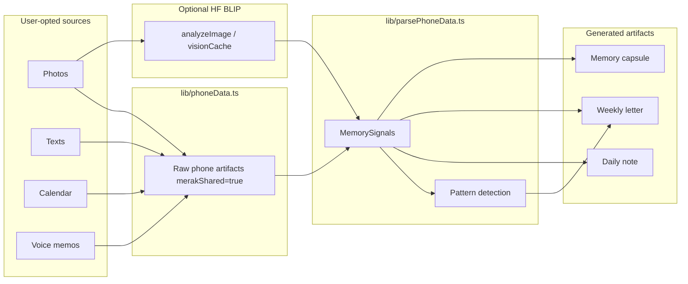

# Merak Architecture

## Problem

Camera rolls store thousands of moments but little *meaning*. Scraping the whole phone feels invasive. Merak asks: **what if memory only grew from what you explicitly share?**

## Data flow

## Key modules

| Path | Role |
|------|------|
| `lib/phoneData.ts` | Simulated device exports (demo) |
| `lib/parsePhoneData.ts` | Parser + template generators |
| `lib/patterns.ts` | Rule-based "Merak noticed" |
| `lib/provenance.ts` | Source links for letters/notes |
| `lib/generateMemory.ts` | Cached `parseAndReflect()` for UI |
| `lib/generateLetterOpenAI.ts` | Optional OpenAI letter |
| `app/api/analyze-photo` | BLIP caption endpoint |
| `app/api/generate-letter` | Letter endpoint |

## Consent model

Every artifact has `merakShared: boolean`. Parser filters `merakShared && inWeek(timestamp)` before creating signals. UI copy reinforces opt-in-only.

## Provenance

`relatedSignalIds` on notes/letters resolve to `/phone?tab=…&highlight=…` via `lib/provenance.ts`.
